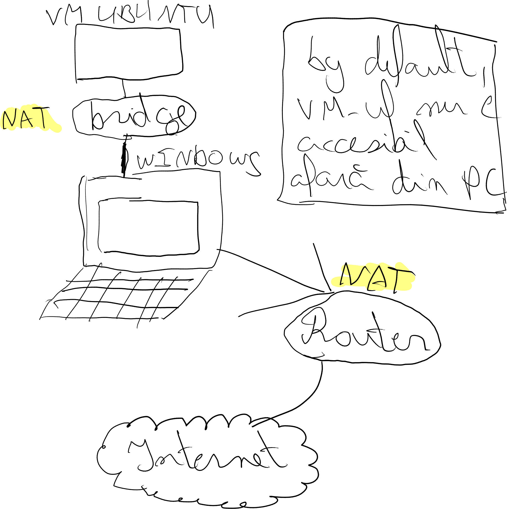

### Client

- ip server
- port server

## Comenzi
### Socket

- `netstat`, vechi
- `ss` (socket statistics), nou

### Ip

- `ipconfig` windows
- `ifconfig` linux, vechi
- `ip addr` linux, nou

### Ping

- `ping`

## Adrese ip

### Private

(false, nonroutabile)

- în LAN
- exemple:
	- 192.168.0.*
	- 192.168.1.*
	- 172.30.*.*

### Publice

(reale, routabile)

- în WAN

## NAT (Network Address Translation)

Face routerul

### SNAT (Source Network Address Translation)

Din adresă privată în adresă publică

### DNAT (Destination Network Address Translation)

(port forwaring, virtual servers)

Din adresă publică în adresă privată

## Probleme

### 1
- IP client: 192.168.1.17
- IP server: 192.168.1.37

Sunt obligatoriu în aceeași rețea?

NU

## Exemple

### VM

### Worldwide

### Malicious DHCP

IP-ul routerului trebuie să facă parte din aceeași clasă cu IP-urile calculatoarelor din rețea.

TODO: Server `DHCP` care nu e pe router.
